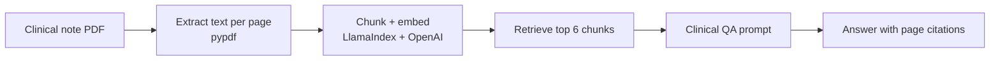

# Clinical RAG

Ask plain-language questions about an ICU clinical note (PDF) and get answers that cite the exact page they came from, with an automated evaluation that checks every answer against the source.

> **Not medical advice.** Built and tested only on a synthetic clinical note. Do not use with real patient data.

## Why I built this

While traveling in Bali, I got talking with two nurses from Australia. When I asked what the hardest part of their job was, I expected to hear about long shifts or difficult patients. Instead, they talked about paperwork. Every time they took over a patient, they had to dig through pages of clinical notes to find the few things that mattered right then: what medications had actually been given, what the latest labs showed, and what the plan was.

That stuck with me. I work with data and machine learning every day, and this felt like a problem I could actually do something about. So I started building a tool where a nurse could upload a clinical note, ask a question in plain language, and get an answer that points to the exact page it came from, so they can check it in seconds instead of trusting it blindly.

Getting an answer was the easy part. Getting a *correct* one was harder. Early versions listed a medication as given when the note only said it was being considered, which is exactly the kind of mistake that matters in a hospital. Most of this project has been about catching errors like that and proving the fixes work.

## How it works



The pipeline prints three debug checkpoints so a wrong answer can be traced to the stage that caused it:

1. **Extracted text:** is the PDF text real and readable?
2. **Retrieved chunks:** did retrieval pull the right parts of the note (with page numbers and scores)?
3. **Final answer:** did the model use those chunks correctly?

## Results

Evaluated on 10 questions about a synthetic ICU note (septic shock from pneumonia, ARDS, AKI). An LLM judge (`gpt-4o-mini`, temperature 0) grades each answer PASS or FAIL on factual accuracy and citation accuracy, and every failure was checked by hand against the note.

| Version | Change | LLM-judge score |
|---|---|---|
| Baseline | Default settings: 2 chunks retrieved per question | 7/10 |
| Current | 6 chunks retrieved per question + clinical QA prompt | 9/10 |

Retrieving more chunks per question (2 → 6) fixed answers that were missing information spread across the note, such as the full diagnosis and ventilator settings. More context alone didn't fix reasoning errors, like reporting a planned medication as given, so the clinical prompt handles those.

### Failure modes found and fixed

| Failure | Example from the note | Fix |
|---|---|---|
| Planned treatment reported as given | Note says "consider dexmedetomidine... not today"; model listed it as administered | Prompt rule: only list medications the note says were actually given |
| Similar-sounding field chosen over the right one | Answered "primary diagnosis" with the Primary ICD-10 billing code instead of the Primary ICU Diagnosis | Prompt rule: pick the field that matches the question's clinical meaning, not the most overlapping words |
| Resolved value still called abnormal | Lactate 1.6, "normalized from 5.2," listed as abnormal | Prompt rule: judge the current value, not the trend language |

### Known limitations

- **Abnormal labs still fail sometimes.** With 8+ lab values in one section, the model drops some (e.g., WBC 18.4, PT/INR) even when retrieval finds the right chunk. I chose not to hardcode outside reference ranges to force a pass, so every answer stays traceable to the note.
- **Tested on one note so far.** Next step is testing on structurally different notes to show the fixes generalize.
- **No OCR.** Scanned PDFs without a text layer are rejected with an error.
- **The judge can be wrong**, which is why failures are verified by hand.

## Run it

Requires Python 3.10+ and an OpenAI API key.

```bash
git clone https://github.com/ManvishK7122/clinical-rag.git
cd clinical-rag
python -m venv venv
source venv/bin/activate        # Windows: venv\Scripts\activate
pip install -r requirements.txt
cp .env.example .env            # then add your OpenAI API key
```

Put a synthetic clinical note PDF in `data/` named `Sample_ICU_note.pdf` (or change `DEFAULT_FILENAME` in `config.py`), then:

```bash
python query.py   # ask questions interactively
python eval.py    # run the 10-question evaluation
```

## Project structure

| File | Purpose |
|---|---|
| `query.py` | Loads the PDF, builds the index, answers questions with debug checkpoints |
| `prompts.py` | Clinical QA prompt and the reasoning behind each rule |
| `eval.py` | Runs the 10 test questions and grades them with an LLM judge |
| `config.py` | Settings such as file name and number of retrieved chunks |
| `docs/` | Development log with every test run |

## Next steps

- Evaluate on more synthetic notes with different layouts
- Automated tests and CI that fail if accuracy drops below 80%
- FastAPI service and a simple web UI
- Compare plain RAG against a tool-calling agent on the same evaluation

## Stack

Python, LlamaIndex, OpenAI API, pypdf